# Social Network Website Using Link Prediction Models for Follower Suggestions


## Project Introduction
We developed a social network website inspired by Instagram. The project includes a website for users and another for administrators using a NoSQL database. The user site provides all the basic features of a social network such as posting, liking, commenting on posts, as well as following, messaging, etc. between users. The admin site allows for statistical analysis and management of content such as posts, users, user reports, and more. In addition, using graph theory and link prediction algorithms, we employ four link prediction algorithms based on node similarity: Common Neighbor, Jaccard, Adamic-Adar, and Katz Index.
* This project is used to serve as a final term project for two courses in the Information Systems department at UIT: Web Application Development - IS207 (9.5/10) and Social Network - IS353 (9/10)

## Team Members

| ID        | Name         | Facebook                          | Contribution %  |
| :-------- | :----------- | :-------------------------------- | :-------------- |
| 21522791  | Nguyễn Hoàng Việt | [Nguyễn Hoàng Việt](https://www.facebook.com/NgyenHoangViet) | 100 |
| 21520400  | Nguyễn Hoàng Phúc | [Nguyễn Hoàng Phúc](https://www.facebook.com/hoangphucseiza) | 100 |

## Technologies Used

- **Frontend**: React, Redux, Bootstrap
- **Backend**: NodeJS, ExpressJS, FastAPI
- **Real-time**: Socket.IO
- **Database**: MongoDB
- **Graph Theory & Link Prediction**: NetworkX

## Database Schema 


## Main Features of the Website
----------------
### Main Features for Users
> * Login / Register (API Token)
> * Create/Like/Comment/Report Posts
> * Follow/Search/View Other Users' Profiles
> * Real-time Notifications/Messaging/Calling
> * Manage Own Profile

### Main Features for Admins
> * Dashboard
> * Manage Posts
> * Manage Users
> * Manage Post Reports

## Demo of Some Interfaces

<details>
<summary>User Interface</summary>
  
>* Login

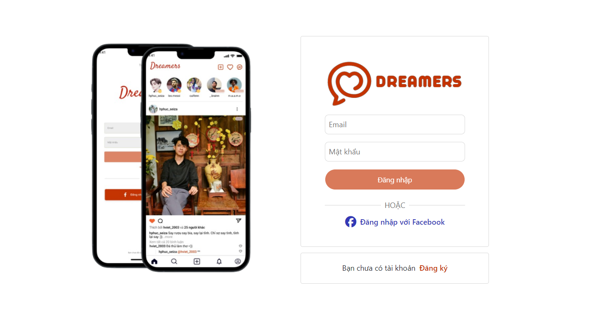

>* Home Page

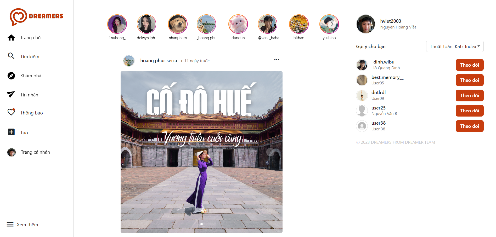

>* Create Post

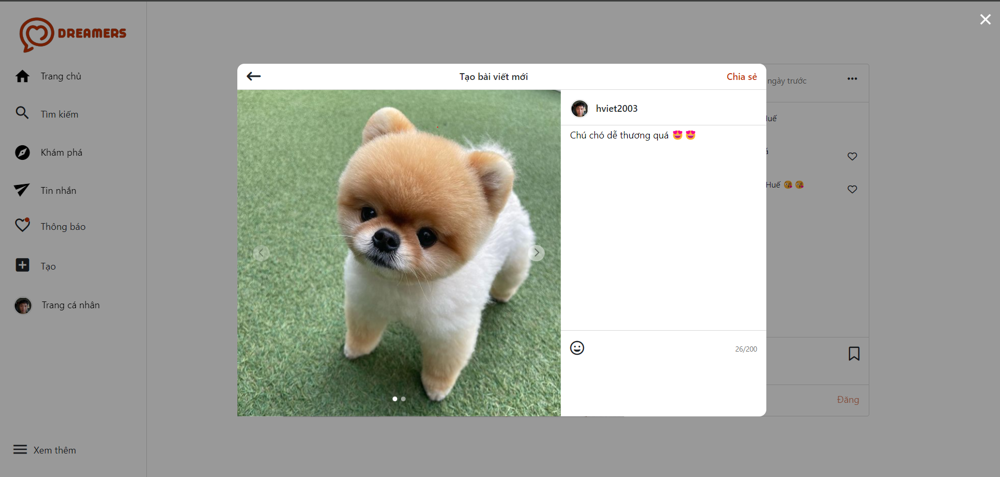

>* Comment on Post

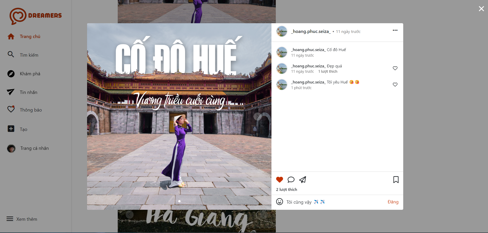

>* Search and Explore

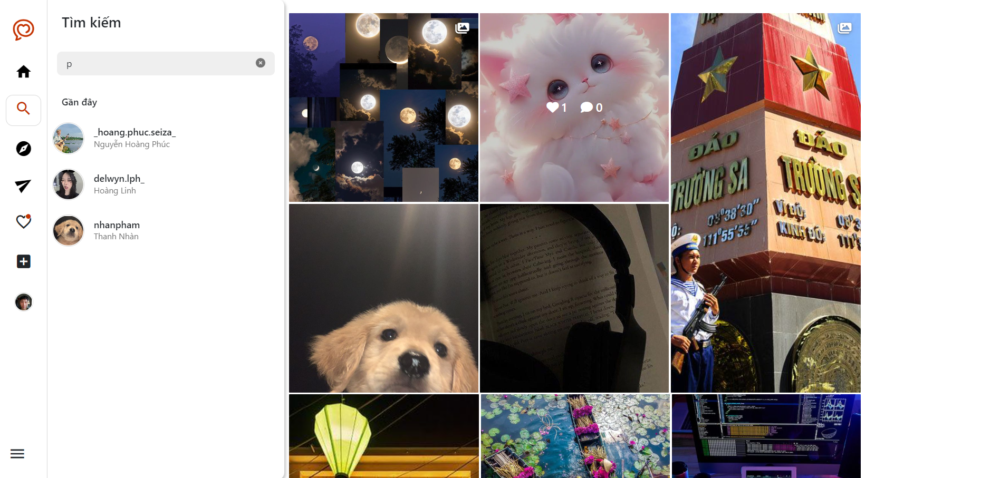

>* Messaging

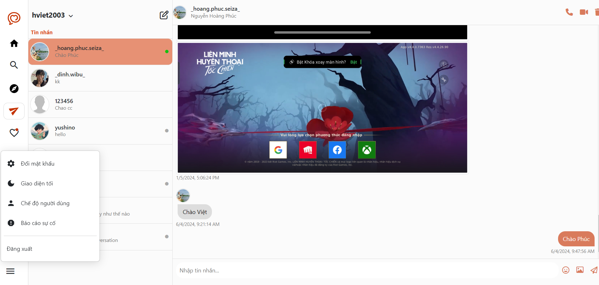

>* Notifications and Profile

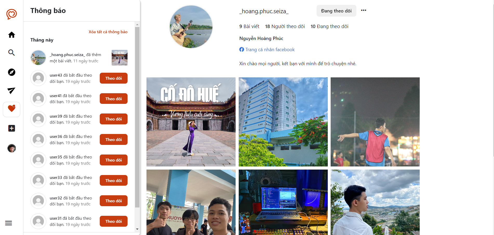
</details>

<details>
<summary>Admin Interface</summary>
  
>* Dashboard

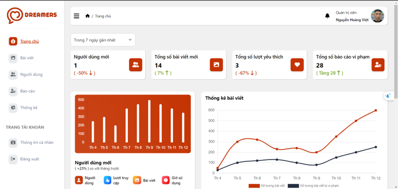

>* Manage Posts

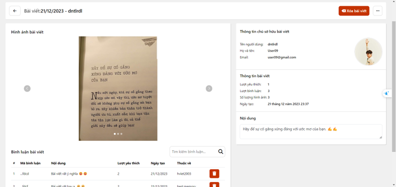

>* Manage Users

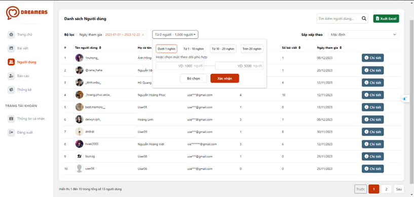

>* User Statistics and Send Email

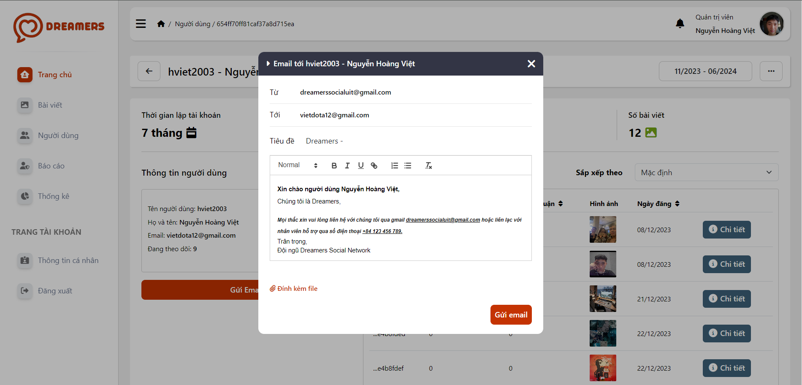

>* Manage Post Reports

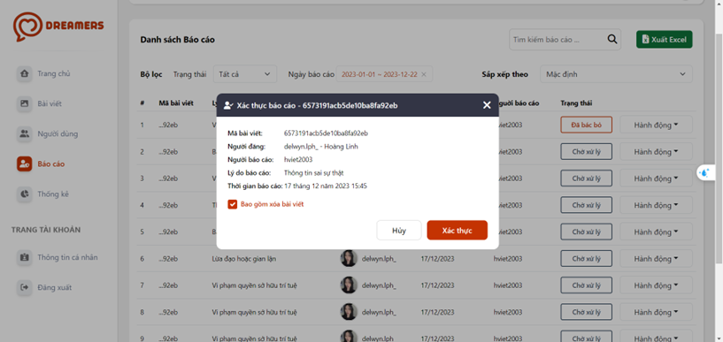
</details>

## Installation Guide

### Prerequisites
- Node.js
- npm or yarn
- Python 3.x (for FastAPI and NetworkX)
- MongoDB (local or cloud instance)

### Frontend Setup
1. **Clone the repository and navigate to the client directory:**
   ```bash
   git clone https://github.com/NHViet03/Web_Social_Network_with_Link_Prediction
   cd /Web_Social_Network_with_Link_Prediction/client
   
2. **Install dependencies:**
   ```bash
   npm install

3. **Start the client frontend server:**
   ```bash
   npm start
   
4. **Navigate to the admin directory and install dependencies:**
   ```bash
   cd /Web_Social_Network_with_Link_Prediction/admin
   npm install
   
5. **Start the admin frontend server:**
   ```bash
   npm start
   
### Backend Setup
1. **Navigate to the backend directory and Install dependencies:**
   ```bash
   cd /Web_Social_Network_with_Link_Prediction
   npm install

2. **Set up environment variables, create a .env file with:**
   ```bash
   MONGODB_URL=your_mongodb_connection_string
   ACCESS_TOKEN_SECRET=your_access_key
   REFRESH_TOKEN_SECRET=your_refresh_key

3. **Start the backend server:**
   ```bash
   npm start
   
### FastAPI Setup (for follower suggestion)
1. **Install FastAPI, NetworkX and required libraries:**
   ```bash
   pip install fastapi uvicorn networkx
   npm install
   
2. **Navigate to the FastAPI directory:**
   ```bash
   cd /Web_Social_Network_with_Link_Prediction/fastAPIServer

3. **Start the FastAPI server::**
   ```bash
   python -m uvicorn index:app --reload
  
## Related Project
- [Mobile-App_Social_Network](https://github.com/NHViet03/Mobile-App_Social_Network)

## References

- [MERN Stack - Build a social media app](https://github.com/devat-youtuber/MERN-Stack-Build-a-social-media-app)
